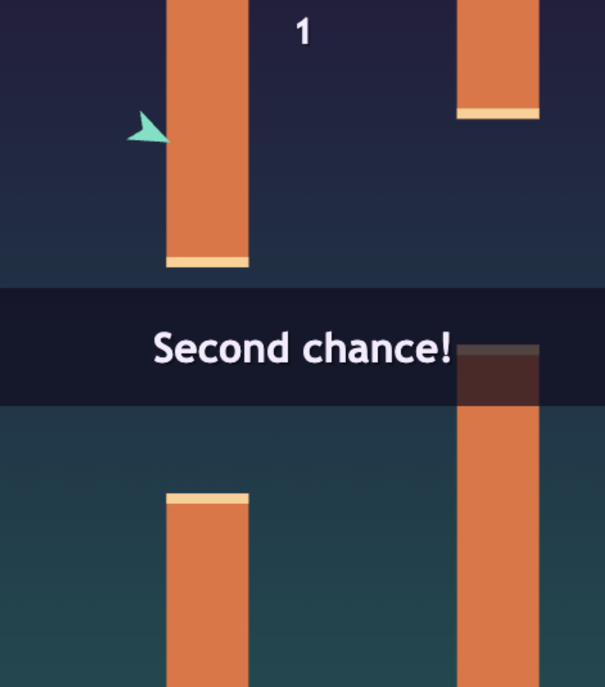
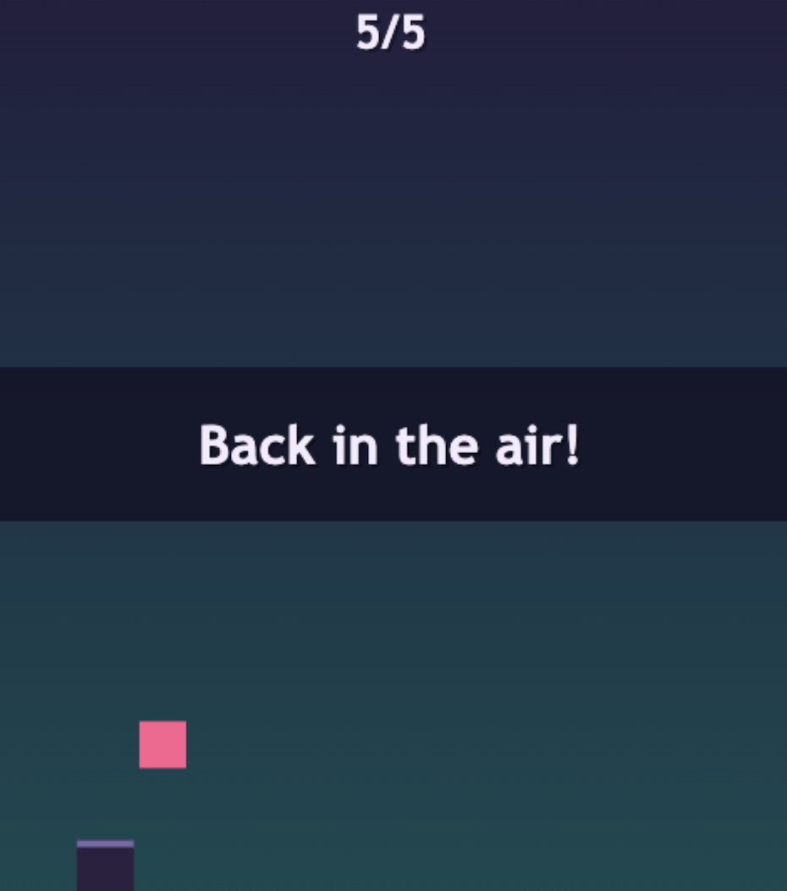

# Refly

**One twist on the classic flap-through-gaps formula: dying isn't game over.**

Slip through the gaps, rack up a score, and the moment you clear a pipe you
didn't think you would — you get comfortable. Then you clip one. Instead of
a game-over screen, you drop straight into **the Hop**, a short, frantic
side-scrolling dash. Clear it and you're back in the air exactly where you
left off — same score, same pipes, same difficulty, like nothing happened.
Fail the Hop, and *that's* your real game over.

Die, Hop, resume, die again. The cycle repeats for as long as you can keep
surviving the second chance.

<p align="center">
  <a href="https://jacobptnguyen.github.io/refly/">
    
  </a>
</p>

<p align="center">
  
  &nbsp;&nbsp;
  
</p>

<p align="center"><sub>Left: flight mode. Right: the Hop, triggered on death.</sub></p>

## How it plays

- **Flight mode** — tap to flap, thread the gaps, score climbs, pipes speed
  up and gaps tighten as you go.
- **Die, and the run doesn't end** — you fall into the Hop instead, with
  difficulty scaled to how far you'd gotten.
- **The Hop** — one button, one job: jump the obstacles as they scroll by.
  Clear all of them and you're launched back into flight, score intact, with
  a brief moment of grace before collisions count again.
- **Fail the Hop** — and only then is the run actually over.

## Controls

One input does everything, context-dependent:

- **Space / click / tap** — flap upward in flight mode, jump in the Hop
  (jump only registers while grounded), start the run from the menu, and
  return to the menu from the game-over screen.

## Play it locally

Static files only — no build step, no dependencies. Because `index.html`
loads `js/main.js` as an ES module, it needs to be served over HTTP (ES
modules don't work over `file://`).

```sh
python3 -m http.server 8000
```

Then open `http://localhost:8000` and hit Space to start.

## Under the hood

- Vanilla HTML/CSS/JS, zero dependencies, zero build step.
- All visuals are drawn live with Canvas 2D primitives — no image or audio
  assets.
- A single `requestAnimationFrame` loop drives a small state machine (menu →
  flight → death transition → Hop → resume transition → flight...) with a
  snapshot/restore contract that carries score, pipes, and difficulty across
  the death → Hop → resume cycle untouched.

See [`DESIGN.md`](DESIGN.md) for the full state machine and mechanics spec.

```
index.html            loads js/main.js as an ES module
style.css
js/
  constants.js         all tunable numbers (physics, pipe/obstacle config, timings)
  state.js             GameState enum + shared `game` object shape
  input.js             keyboard/pointer/touch -> single edge-triggered action
  render.js            shared draw helpers (menu/HUD/game-over/overlay text)
  flight.js            createSession/update/render/snapshot/restore for flight mode
  minigame.js          createSession/update/render for the Hop
  main.js              canvas setup, game loop, state-machine dispatch (glue only)
README.md
bugs.md
DESIGN.md             authoritative design spec
```
